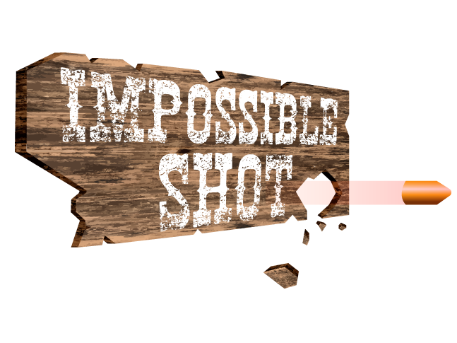

# Impossible Shot

Impossible shot is an endless game where you control a bullet that has been fired by a sheriff. The goal is to kill as many enemies while dodging  obstacles as they appear.

This is a game (demo/protoype/vertical slice) developed by students from <a href="https://www.imagecampus.edu.ar/">Image Campus</a>

   

## Credits
(in alphabetical order)
- **Agustin Llanos** - *Audio* -      
- **Francisco José Birto Evans** - *Audio* -      
- **Luciano Novak** - *Programming & game design* -              --->

This game was also possible thanks to the support of these professors:

- **Eugenio Taboada**
- **Fernando Puig**
- **Jorge Cuéllar**
- **Juan Pablo Bettini**
- **Sergio Baretto**

## Acknowledgements

We want to thank all the people at the Nucleo 2018 event who gave us so much helpful feedback. 

## Links

Download it from itch.io: https://impossibleshot.itch.io/impossibleshot
